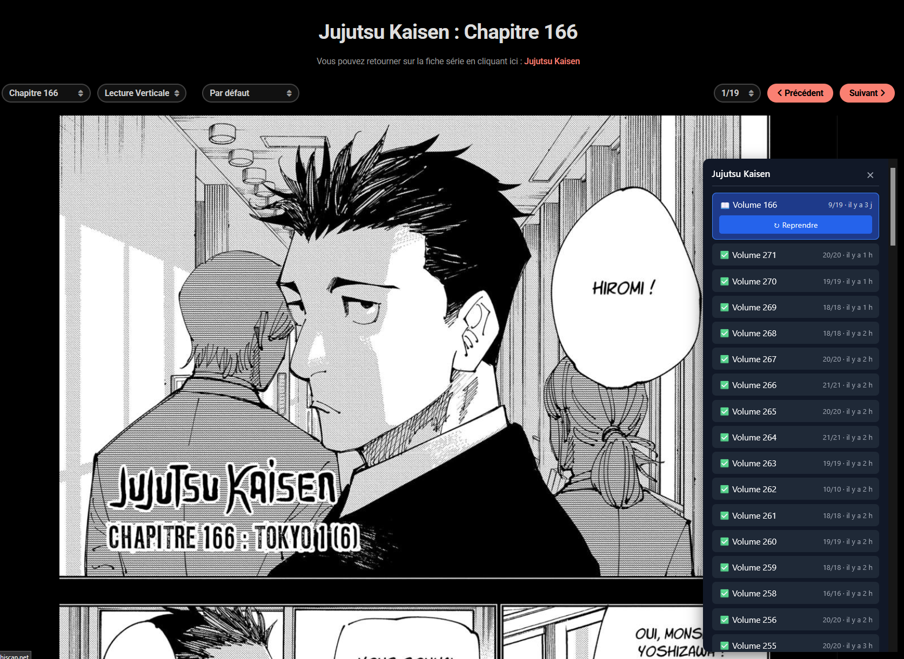

# Sushiscan Manga Tracker

Extension Firefox qui mémorise ta progression de lecture sur `sushiscan.net`.

Quand tu arrives sur une page de volume ou de chapitre (ex: `https://sushiscan.net/jujutsu-kaisen-chapitre-166/`), un panneau repliable apparaît en bas à droite. Il liste l'historique de lecture de **cette série**, indique la dernière page atteinte, et propose un bouton **« ↻ Reprendre »** qui te scroll automatiquement à l'endroit où tu t'étais arrêté.

Les données sont stockées **localement dans IndexedDB** (privées à ton profil Firefox). Aucune connexion réseau, rien n'est envoyé nulle part.



---

## 📦 Installation sur Firefox

Il y a **deux modes d'installation**. Le mode A est instantané mais temporaire (à refaire à chaque redémarrage de Firefox). Le mode B est permanent mais demande quelques minutes de setup.

### Mode A — Installation temporaire (le plus simple, recommandé pour commencer)

L'extension reste chargée jusqu'à ce que tu fermes Firefox. À chaque redémarrage du navigateur, il faut refaire ces 4 étapes.

1. **Récupère le code** quelque part sur ton disque. Si tu lis ce README, c'est déjà fait — repère bien le chemin du dossier (ex : `/home/tdemares/dev_folder/ext_manga/`).

2. **Ouvre Firefox**, puis dans la barre d'adresse tape :
   ```
   about:debugging#/runtime/this-firefox
   ```

3. Clique sur le bouton **« Charger un module complémentaire temporaire… »** (en haut à droite de la liste des extensions).

4. Dans la fenêtre qui s'ouvre, **sélectionne le fichier `manifest.json`** à la racine du dossier de l'extension. Clique sur Ouvrir.

✅ L'extension est chargée. Tu devrais voir « Sushiscan Manga Tracker » apparaître dans la liste « Extensions temporaires ».

> ⚠️ **Limite du mode A** : la base IndexedDB est conservée tant que tu ne supprimes pas le profil Firefox. Mais l'extension elle-même se décharge à la fermeture de Firefox — il faut la recharger via `about:debugging` à chaque session. Tes données de lecture, elles, sont préservées.

### Mode B — Installation permanente

Pour ne plus avoir à recharger à chaque démarrage, deux options :

#### B.1 — Firefox Developer Edition ou Nightly (le plus simple en permanent)

Ces variantes de Firefox permettent de désactiver la signature obligatoire des extensions.

1. Télécharge [Firefox Developer Edition](https://www.mozilla.org/firefox/developer/) ou [Firefox Nightly](https://www.mozilla.org/firefox/channel/desktop/#nightly).
2. Lance-le, va sur `about:config` et accepte le warning.
3. Cherche `xpinstall.signatures.required` et passe-le à `false`.
4. Empaquette l'extension en `.xpi` :
   ```bash
   cd /chemin/vers/ext_manga
   zip -r -FS manga-tracker.xpi * -x "*.git*" "*.md" "assets/*"
   ```
5. Dans Firefox, va sur `about:addons`, clique sur l'engrenage ⚙️ → **« Installer un module depuis un fichier »**, choisis le `.xpi`.

#### B.2 — Signature via Mozilla (Firefox standard)

Pour utiliser l'extension sur le Firefox stable sans bidouille, il faut la faire signer par Mozilla.

1. Crée un compte sur [addons.mozilla.org](https://addons.mozilla.org/developers/).
2. Installe l'outil `web-ext` :
   ```bash
   npm install --global web-ext
   ```
3. Soumets l'extension pour signature en mode "self-distribution" (signature uniquement, pas de listing public) :
   ```bash
   cd /chemin/vers/ext_manga
   web-ext sign --api-key=<JWT_ISSUER> --api-secret=<JWT_SECRET> --channel=unlisted
   ```
   Les clés API se génèrent depuis [le panneau développeur AMO](https://addons.mozilla.org/developers/addon/api/key/).

4. La commande produit un fichier `.xpi` signé. Tu l'installes via `about:addons` → ⚙️ → **« Installer un module depuis un fichier »**.

C'est la procédure officielle, mais elle prend du temps (review automatique chez Mozilla, quelques minutes en général).

---

## 🚀 Utilisation

1. Ouvre n'importe quelle page de volume ou de chapitre sushiscan, ex :
   - `https://sushiscan.net/jujutsu-kaisen-chapitre-166/`
   - `https://sushiscan.net/fairy-tail-volume-12/`
   - `https://sushiscan.net/one-piece-chapter-1100/`

2. Un petit bouton **📖** apparaît en bas à droite de la page. Clique dessus pour déplier le panneau.

3. **Lis normalement.** L'extension détecte automatiquement la page-image actuellement à l'écran, et sauvegarde ta position toutes les ~1,5 s pendant le scroll. Une sauvegarde finale est faite quand tu fermes l'onglet.

4. **Quand tu reviens sur le même volume/chapitre plus tard**, le panneau affiche :
   - La page où tu en étais (ex : `9/19`)
   - Un bouton **↻ Reprendre** qui scroll automatiquement à ta dernière position
   - Un historique des autres entrées lues de la même série

5. Le panneau ne montre **que la série de la page courante**. Si tu passes de Fairy Tail à One Piece, c'est un autre contexte, isolé.

> 💡 Le bouton 📖 a un petit point orange si une position est déjà sauvegardée pour ce volume.

---

## 🔧 Inspecter / déboguer

Pour voir ce que l'extension a stocké :

1. Va sur `about:debugging#/runtime/this-firefox`.
2. Trouve l'extension dans la liste, clique sur **« Inspecter »**.
3. Onglet **Stockage** → **Stockage indexé** → `https://sushiscan.net` → `manga-tracker` → `volumes`.

Tu y verras un enregistrement par URL visitée :

```js
{
  url: "https://sushiscan.net/fairy-tail-volume-12/",
  series: "fairy-tail",
  seriesTitle: "Fairy Tail",
  volume: 12,
  page: 87,
  totalPages: 200,
  scrollY: 14523,
  firstVisitedAt: 1714000000000,
  lastVisitedAt: 1714600000000
}
```

Pour voir les logs de l'extension : dans la fenêtre d'inspection, onglet **Console** filtre `[manga-tracker]`.

---

## 📁 Structure du code

```
manifest.json          — Manifest V3 Firefox
background.js          — Event page : route les messages vers IndexedDB
content/
  content.js           — Injecté sur sushiscan.net : panneau + tracking scroll
  content.css          — Styles isolés du panneau
lib/
  url-parser.js        — parseSushiUrl() : extrait {series, type, number} d'une URL
  db.js                — Wrapper IndexedDB (open, get, put, queryBySeries)
icons/
  icon.svg             — Icône de l'extension
assets/
  example.png          — Capture d'écran pour le README (non chargée par l'extension)
```

---

## ❓ Problèmes fréquents

**Le panneau ne s'affiche pas sur une page sushiscan.**
- Vérifie que l'URL matche bien `/{série}-(volume|chapitre|chapter)-{N}/`. Les autres formats (fiches série, one-shots sans numéro…) ne sont pas trackés.
- Recharge la page (`F5`) — l'extension n'agit qu'au chargement.
- Ouvre la console de l'extension via `about:debugging` → Inspecter, et regarde si une erreur apparaît.

**Le bouton « Reprendre » n'apparaît pas.**
- Il n'apparaît que si une position est déjà sauvegardée (`scrollY > 0`). Première visite = pas de bouton.

**Le tracking ne suit pas la page courante.**
- Les sélecteurs d'images sont des heuristiques (`#readerarea img`, `.ts-main-image`...). Si sushiscan change son DOM, vérifie la console : un warning `no manga images detected` apparaît. Il suffit d'ajouter le bon sélecteur dans `content/content.js` → `detectImages()`.

**J'ai perdu mes données après avoir réinstallé Firefox.**
- IndexedDB est attaché au profil Firefox. Si tu réinstalles ou changes de profil, les données restent dans l'ancien profil. Pas de sync cloud.

---

## 🚫 Hors-scope

- Pas de tracking pour les one-shots ou autres patterns sans numéro (seuls `volume`, `chapitre`, `chapter` sont reconnus).
- Pas de vue cross-manga : le panneau ne montre que la série de la page courante.
- Pas de synchronisation cloud / multi-device.
- Pas d'export/import des données (à ajouter plus tard si besoin).
